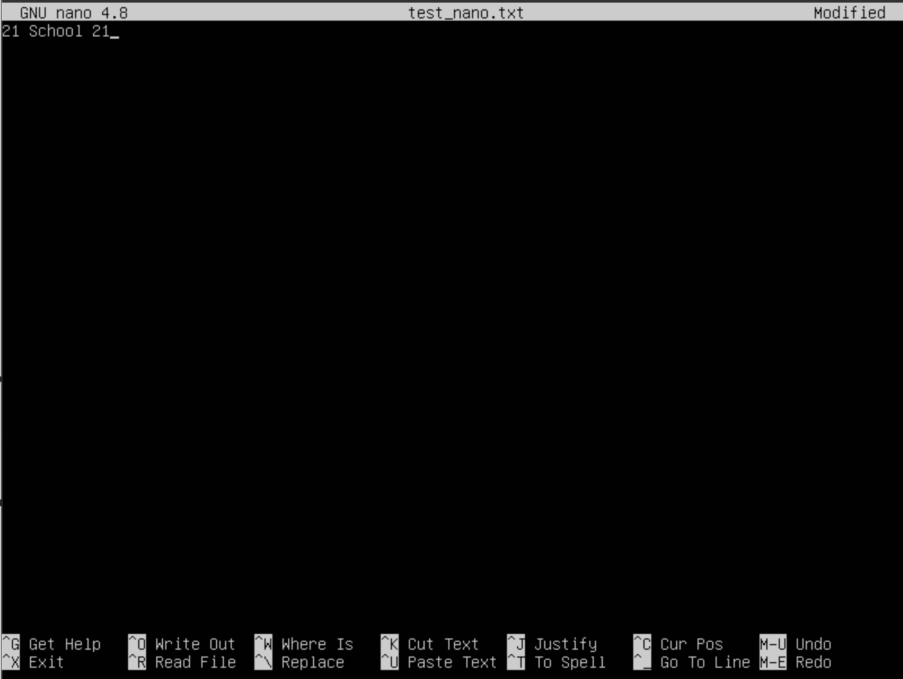
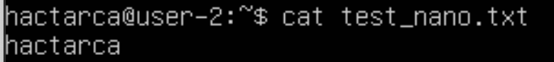
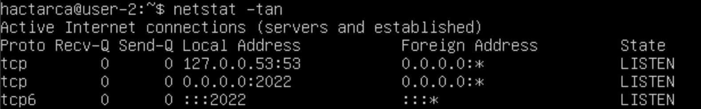
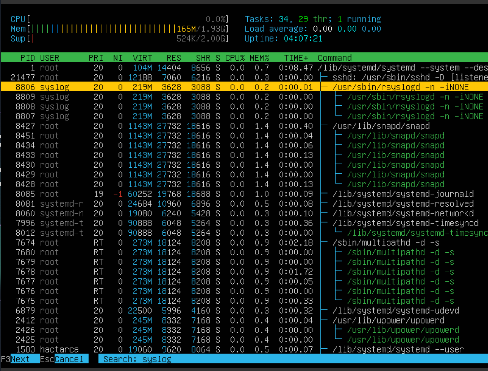

# Операционные системы UNIX/Linux (Базовый).

1. [Установка ОС](#part-1-установка-ос)  
2. [Создание пользователя](#part-2-создание-пользователя)  
3. [Настройка сети ОС](#part-3-настройка-сети-ос)   
4. [Обновление ОС](#part-4-обновление-ос)  
5. [Использование команды  sudo](#part-5-использование-команды-sudo)  
6. [Установка и настройка службы времени](#part-6-установка-и-настройка-службы-времени)  
7. [Установка и использование текстовых редакторов](#part-7-установка-и-использование-текстовых-редакторов)  
8. [Установка и базовая настройка сервиса SSHD](#part-8-установка-и-базовая-настройка-сервиса-sshd)   
9. [Установка и использование утилит top, htop](#part-9-установка-и-использование-утилит-top-htop)   
10. [Использование утилиты fdisk](#part-10-использование-утилиты-fdisk)   
11. [Использование утилиты df](#part-11-использование-утилиты-df)    
12. [Использование утилиты du](#part-12-использование-утилиты-du)    
13. [Установка и использование утилиты ncdu](#part-13-установка-и-использование-утилиты-ncdu)    
14. [Работа с системными журналами](#part-14-работа-с-системными-журналами)     
15. [Использование планировщика заданий CRON](#part-15-использование-планировщика-заданий-cron)

## Part 1. Установка ОС
+ 
+ Отображение команды ```cat /etc/issue```
## Part 2. Создание пользователя
+ 
+ Команда для создания пользователя

+ 
+ Вывод команды ```cat /etc/passwd```
## Part 3. Настройка сети ОС
* Задание нового названия машины

+ 
+ С помощью команды ```sudo hostnamectl set-hostname user-1``` установим новое имя машины

* Установка временной зоны, соответствующей нашему текущемму местоположению

+ 
+ Командой ```date``` проверям какие параметры были установленны

+ 
+ Командой ```sudo timedatectl set-timezone Europe/Moscow``` устанавливаем нужную временную зону. Проводим повторную проверку.

* Вывод названий сетевых интерфейсов с помощью консольной команды

+ 
+ Команда ```ip l``` выводит нам информацию о сетевых интерфейсах

+ Lo (loopback device) – виртуальный интерфейс, присутствующий по умолчанию в любом Linux. Он используется для отладки сетевых программ и запуска серверных приложений на локальной машине. С этим интерфейсом всегда связан адрес 127.0.0.1. У него есть dns-имя – localhost.

* Получение ip адреса устройства от DHCP сервера

+ 
+ Командой ```ip r``` выводм ip устройства

+ DHCP (англ. Dynamic Host Configuration Protocol — протокол динамической настройки узла) — прикладной протокол, позволяющий сетевым устройствам автоматически получать IP-адрес и другие параметры, необходимые для работы в сети TCP/IP. Данный протокол работает по модели «клиент-сервер».›

* Определяем и выводим внешний ip-адрес шлюза и внутренний ip-адрес шлюза

+ 
+ Чтобы вывести внешний ip-адрес шлюза, используем команду ```curl ifconfig.co```
+ IP - 195.133.239.85

+ 
+ Чтобы вывести внутренний ip-адрес шлюза, используем команду ```ip route```
+ IP - 10.0.2.2

* Задаем статичные настройки ip, gw и dns

+ 
+ Командой ```sudo vim /etc/netplan/00-installer-config.yaml``` откроем файл конфигурации netplan
+ Командой ```sudo netplan apply``` сохраняем изменения и презагружаем систему

+ 
+ 
+ После перезагрузки виртуальной машины, командами ```cat /etc/netplan/00-installer-config.yaml``` и ```ifconfig```, проверяем, сохранились ли изменения. 

+ 
+ Пингуем удаленные хосты 1.1.1.1 и ya.ru 

## Part 4. Обновление ОС

+ 
+ 
+ Команды для обнвления системных пакетов ```sudo apt update``` и ```sudo apt full-upgrade```

+ 
+ После обновления и последующего ввода команд, получаем сообщение, что все пакеты обновлены до последней версии

## Part 5. Использование команды sudo

+ Команда sudo ( substitute user and do, подменить пользователя и выполнить ) позволяет строго определенным пользователям выполнять указанные программы с административными привилегиями без ввода пароля суперпользователя root. Если быть точнее, то команда sudo позволяет выполнять программы от имени любого пользователя, но, если идентификатор или имя этого пользователя не указаны, то предполагается выполнение от имени суперпользователя root

+ Добавление посльзователя в sudo
+ 
+ Чтобы разрешить пользователю выполнять команду sudo, нужно добавть его в группу sudo, командой ```sudo usermod -a -G sudo hactarca111```

+ Переход на другого пользователя
+ 

+ Сменя hostname
+ 
+ Командой ```hostnamectl``` смотри текущее имя. Дальше, уже знакомой командой ```sudo hostnamectl set-hostname user-2``` меняем имя на 'user-2'.  И проверяем!

## Part 6. Установка и настройка службы времени

+ Вывод времени часового пояса в котором я нахожусь
+ 
+ Команды ```date```

+ Вывод команды ```timedatectl show``` содержит в себе NTPSynchronized=yes, из чего следует что служба синхронизации времени у нас работает
+ 

## Part 7. Установка и использование текстовых редакторов

+ 
+ Устанавливаем 3 текстовых редакторы
+ Команды ```sudo apt install vim``` , ```sudo apt install nano```. ```sudo apt install joe```

* Создание файлов

+ 
+ 
+ Создание тестового файла с никнеймом в vim
+ Для выхода с сохранением, после записи нужно нажать 'esc' и прописать ':wq'

+ 
+ 
+ Создание тестового файла с никнеймом в nano
+ Для выхода с сохранением, после записи нужно нажать '^X', прописать 'y' и нажать 'Enter'

+ 
+ 
+ Создание тестового файла с никнеймом в joe
+ Для выхода с сохранением, после записи нужно нажать '^k', нажать 'q' и прописать 'y'

* Редактирование файлов

+ 
+ 
+ Редактирование тестового файла с никнеймом в vim
+ Для выхода без сохранения, после записи нужно нажать 'esc' и прописать ':q!'

+ 
+ 
+ Редактирование тестового файла с никнеймом в nano
+ Для выхода без сохранения, после записи нужно нажать '^X' исф прописать 'n'

+ 
+ 
+ Редактирование тестового файла с никнеймом в joe
+ Для выхода без сохранения, после записи нужно нажать '^k', нажать 'q' и прописать 'n'

* Поиск и редактирование по слову

+ Отредактируем все тестовые файлы по примеру из предыдущего пункта, прописав в них "21 School 21"

+ 
+ Для поиска в текстовом редакторе vim, нужно нажать 'esc' и '/'

+ 
+ 
+ Для редакторивания в текстовом редакторе vim, нужно нажать 'esc' и прописать в нашем случае ```:s /School/Shkola``` и нажать 'Enter'
+ Для выхода с сохранением, после записи нужно нажать 'esc' и прописать ':wq'

+ 
+ Для поиска в текстовом редакторе nano, нужно нажать 'ctrl' и 'w'

+ 
+ 
+ Для редакторивания в текстовом редакторе nano, нужно нажать 'ctrl + \' и прописать то что мы заменяем, а после нажатия на 'Enter', на что мы заменяем. Применяем изменения, нажав 'y'
+ Для выхода с сохранением, после записи нужно нажать '^X', прописать 'y' и нажать 'Enter'

+ 
+ Для поиска в текстовом редакторе joe, нужно нажать 'ctrl + k + f'

+ 
+ 
+ Для редакторивания в текстовом редакторе joe, нужно нажать 'ctrl + k + f' и прописать то что мы заменяем. Нажимаем 'r' 'Enter' и пишем то, на что заменяем. И нажмаем 'y'. 
+ Для выхода с сохранением, после записи нужно нажать '^k', нажать 'q' и прописать 'y'

## Part 8. Установка и базовая настройка сервиса SSHD

* Установка SSHd

+ 
+ Для установки используем команду ```sudo apt install openssh-server```. Командой ```sudo systemctl status ssh```, првоеряем состояние службы ssh. Командой ```sudo systemctl enable ssh``` добавим автостарт службы

+ 
+ 
+ С помощью vim откроем файл sshd_config, и перенастроем службу на порт 2022, изменив параметр port

+ 
+ Командой ```sudo systemctl restart ssh``` перезагружаем ssh, для сохранения изменений. И снова проверяем состояние службы

+ 
+ Используя команду ```ps ax | grep sshd``` , показываем наличие 'sshd'
+ ps - утилита для просмотра списка процессов в Linux. Параметр -a - выбрать все процессы всех пользователей, кроме фоновых. Параметр -x указывает ps перечислить процессы без управляющего терминала. grep -i ssh - выводит только те строчки, где есть ssh с игнорированием регистра.
Символ | перенаправляет вывод команды ps aux на ввод grep -i ssh 

+ 
+ После перезагрузки системы прописываем команду ```netstat -tan```. Вывод содержит строку tcp 0 0 0.0.0.0:2022 0.0.0.0:* LISTEN
+ -a - Вывод всех активных подключений TCP и прослушиваемых компьютером портов TCP и UDP.
-n - Вывод активных подключений TCP с отображением адресов и номеров портов в числовом формате без попыток определения имен. Тогда, если netstat -na - просмотр всех открытых протоколов, то netstat -tan - просмотр всех открытых ТСР-протоколов.
+ Proto - сетевой протокол (tcp, udp);
+ Recv-Q - количество байтов, помещённых в буфер приёма TCP/IP, но не переданных приложению. Если это число высокое, то нужно проверить работоспособность приложения, которое работает с данным портом.
+ Send-Q — количество байтов, помещённых в буфер отправки TCP/IP, но не отправленных, или отправленных, но не подтверждённых. Высокое значение может быть связано с перегрузкой сети сервера.
+ Local Address — локальный адрес сервера. В обычных соединениях, это адрес сервера на который пришло соединение. В прослушиваемых портах (LISTEN) — это диапазон адресов. Так 0.0.0.0:port — значит подключаться можно ко всем адресам сервера, а 192.168.0.35:port — значит подключаться можно только к этому адресу сервера.
+ Foreign Address — адрес второй стороны. В обычных соединениях, это адрес с которого пришло соединение. В прослушиваемых портах (LISTEN) — это диапазон адресов. Так 0.0.0.0:* — значит подключаться можно с любых адресов и с любых портов, а например 192.168.0.50:* — значит подключаться можно только с этого адреса и с любых портов.
+ State — состояние подключения, или прослушивания.

## Part 9. Установка и использование утилит top, htop

* Вывод команды top
+ 

+ uptime - 1:05
+ количество авторизованных пользователей - 1
+ общую загрузку системы - 0.00
+ общее количество процессов - 101
+ загрузку cpu - 0.0 %
+ загрузку памяти - 162.4
+ pid процесса занимающего больше всего памяти - 1
+ pid процесса, занимающего больше всего процессорного времени - 1

* Вывод команды htop
+ 

+ 
+ htop отсортированный по PID

+ 
+ htop отсортированный по PERCENT_CPU

+ 
+ htop отсортированный по PERCENT_MEM

+ 
+ htop отсортированный по TIME

+ 
+ htop отфильтрованный для процесса sshd

+ 
+ htop с процессом syslog, найденным, используя поиск

+ 
+ htop с добавленным выводом hostname, clock и uptime

## Part 10. Использование утилиты fdisk

* Пропишим команду ```sudo fdisk -l```  
+ 

+ название жесткого диска - VBOX HARDDISK
+ размер - 25 GB
+ количество секторов - 52428800
+ размер swap - 2.0 GB

## Part 11. Использование утилиты df

* Пропишем команду df
+ 

+ размер раздела - 11758760
+ размер занятого пространства - 4735868
+ размер свободного пространства - 6403784
+ процент использования - 43%
+ Единицы измерения - Килобайты.

* Пропишем команду df -Th
+ 

+ размер раздела - 12 Gb
+ размер занятого пространства - 4.6 Gb
+ размер свободного пространства - 6.2 Gb
+ процент использования - 43 %
+ Тип файловой системы - ext4

## Part 12. Использование утилиты du

* 
* Запуск команды du

* 
* Вывод размера папок /home, /var, /var/log

* 
* Вывод размера всего содержимого в /var/log

## Part 13. Установка и использование утилиты ncdu

* 
* Установка ncdu

* 
* Вывод размера папок /home, /var. Команда ```ncdu /```

* 
* Вывод размера папок /var/log. Команда ```ncdu /var```

## Part 14. Работа с системными журналами

* /var/log/dmesg
* 


* /var/log/syslog
* 


* /var/log/auth.log
* 

+ время последней успешной авторизации - Mar 27 17:51:25 
+ имя пользователя - hactarca
+ метод входа в систему - session opened for user hactarca by LOGIN(uid = 0)

* 
+ сообщение о перезапуске системы ssh

## Part 15. Использование планировщика заданий CRON

* 
* Вывод всех задач CRON

* 
* Сообщения о выполнении команды

* 
* Вывод всех задач CRON, после удаления